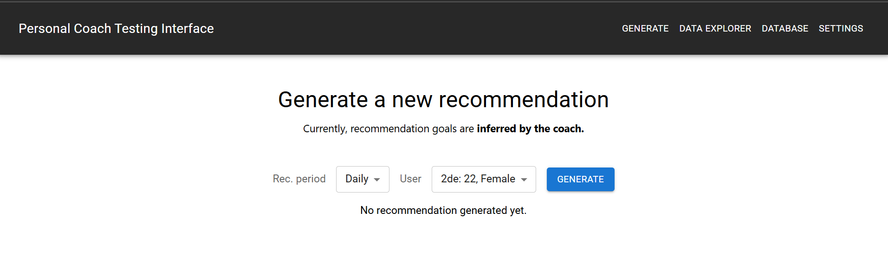
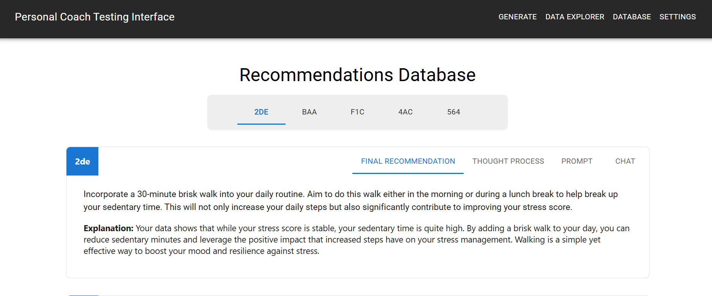
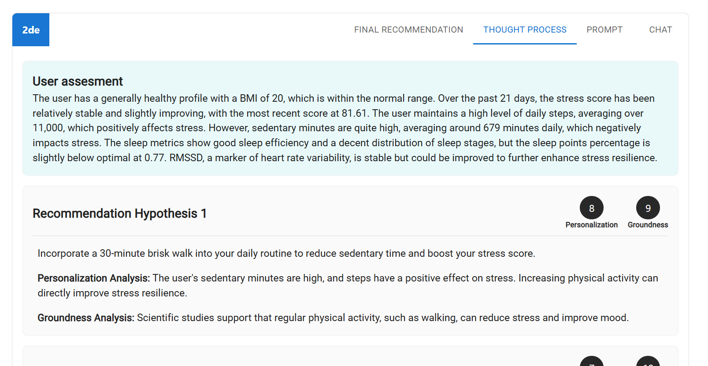
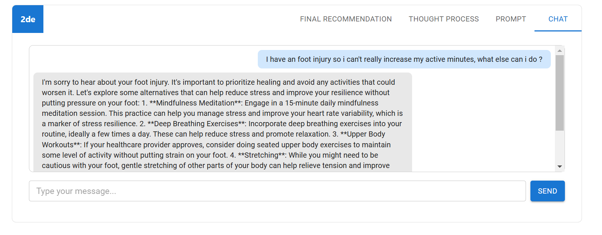
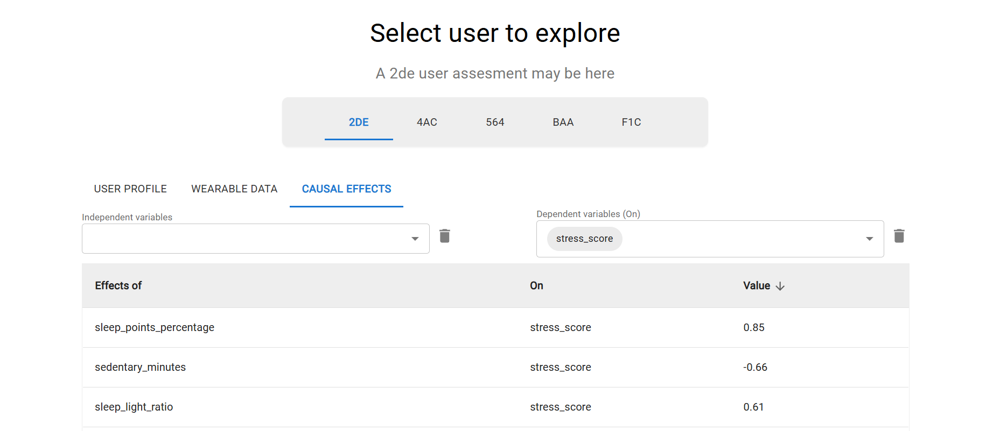
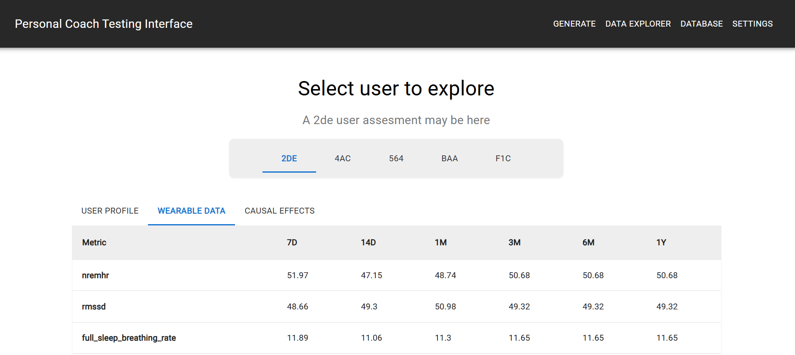
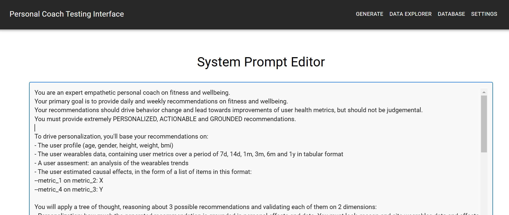

# **Personal Coach Testing Interface**

This project is the **Personal Coach Testing Interface**. Is designed to experiment with and analyze the effectiveness of a personalized fitness and wellbeing recommendation system. The application leverages generative AI (LLMs) and data-driven personalization to deliver actionable, grounded, and behavior-changing recommendations to users.


## **Purpose**
The primary goal of this project is to create a **testing interface** for a **personal coach system** that:
1. Generates **extremely personalized recommendations** using user profiles, wearable device data, and causal relationships between fitness metrics and wellbeing measures.
2. Provides a user-friendly **frontend interface** to:
   - Generate recommendations (daily, weekly).
   - Chat with the coach.
   - Explore user profile data, wearable data, and causal effects driving personalization.
   - Maintain a **database of past recommendations** for review and analysis.
3. Serves as a foundation for experimenting with:
   - The integration of LLMs in personalized digital health systems.
   - Techniques for improving recommendation effectiveness and user engagement.
   - Behavioral change strategies driven by causal insights.


## **Screenshots**
Below are the screenshots demonstrating the features of this interface:

### New Recommendation


### Database View


### Tree of thoughts



### Chat Interface


### Causal Effects


### User wearables


### System prompt



## **Features**
### **1. Generate Recommendations**
- Users can generate **daily** or **weekly** recommendations for fitness and wellbeing.
- Recommendations are grounded in:
  - **User Profile**: Includes age, gender, weight, height, BMI, and other static attributes.
  - **Wearable Data**: Includes activity metrics like steps, sedentary minutes, active minutes, sleep data, and more.
  - **Causal Effects**: Captures relationships between metrics (e.g., "sedentary minutes negatively affect stress").
- A tree-of-thought (ToT) process is used to:
  - Generate a user assesment 
  - Generate multiple recommendations.
  - Validate recommendations on **personalization** and **scientific groundness**.

### **2. Explore Data**
- **Data Explorer**: A tabbed view to explore:
  - User profiles.
  - Wearable device data (preprocessed and summarized for recent days).
  - Causal effects that drive personalized recommendations.

### **3. Review Past Recommendations**
- **Past Recommendations Database**:
  - A searchable interface to view all past recommendations.
  - Each recommendation includes:
    - **Final Recommendation**: The chosen recommendation and explanation.
    - **Thought Process**: The tree-of-thought validation process and scores.
  - Users can filter recommendations by **User ID**.

### **4. Open Ended conversations**
- Users can chat with the model and adapt the context of a generated recommendation.


## **Setup Instructions**
Run the backend firsts.
### **Backend**
1. Clone the repository.
2. Navigate to the backend directory.
2. **Add a .env file in the backend folder with:** ```OPEN_API_KEY=YOUR_KEY```
3. Create a virtual environment and install dependencies:
   ```bash
   python -m venv venv
   source venv/bin/activate  # On Windows: venv\Scripts\activate
   pip install -r requirements.txt
   ```
4. Run the Flask app:
   ```bash
   python app.py
   ```
5. The backend will be available at `http://localhost:8080`.

### **Frontend**
Note: *requires Node 20 or higher*
1. Navigate to the frontend directory.
2. Install dependencies:
   ```bash
   npm install
   ```
3. Start the React app in debug mode with:
   ```bash
   npm start
   ```
4. The frontend will be available at `http://localhost:3000`.

   

### **Running with docker**
It will require some time the first time.

1. Make sure you have the following installed on your system:
    - Docker
    - Docker Compose

2. **Add a .env file in the backend folder with:** ```OPEN_API_KEY=YOUR_KEY```

3. Build and Start the Containers: Use Docker Compose to build and start the services:
    ```bash
    docker-compose up --build
    ```
    This command will build the Docker images for both the frontend and backend and start the containers.

4. Access the service:
    - Frontend (React): Open http://localhost:3000 in your browser.
    - Backend (Flask): Access the API at http://localhost:8080

To stop the containers, press Ctrl+c in the terminal where compose is running.
Remove the containers and associated resources:
```
docker-compose down
```


## **Authors**:
- Fabio Babrieri
